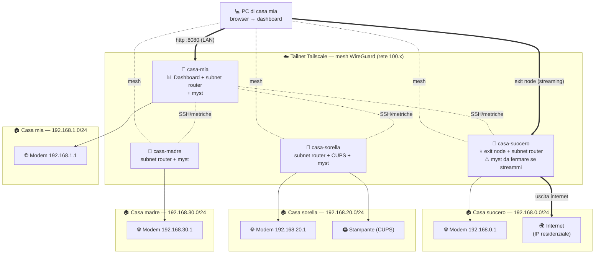

# Setup consigliato — Ubuntu + Tailscale + Mysterium (+ CUPS)

Documenti correlati (stato progetto):

- `README.md` (panoramica e stato attuale)
- `docs/DEPLOYMENT.md` (deploy dashboard su Raspberry)
- `docs/ROADMAP.md` (prossimi miglioramenti)
- `docs/VERSIONING.md` (convenzione commit/versioni/release)

Guida operativa per allestire, in ogni appartamento, un nodo basato su **Ubuntu
(Desktop o Server)**. La base comune a **tutti** i nodi è:

- **Tailscale** (mesh VPN) per monitoraggio, accesso alla LAN e streaming;
- **nodo Mysterium (`myst`)** per monetizzare la banda residenziale;
- predisposizione all'integrazione con la **Raspberry Dashboard**.

Componenti **opzionali**, solo dove servono:

- **CUPS** come server di stampa condiviso sulla mesh (es. a casa di mia
  sorella; installabile anche su un altro nodo che abbia una stampante);
- **Docker + Dashboard**, che gira **solo sul Raspberry di casa mia**.

> Nei comandi di questa guida **`nome_utente`** è l'utente Ubuntu che crei in
> fase di installazione: sostituiscilo ovunque con il tuo.

L'obiettivo è sostituire progressivamente il setup attuale (un server OpenVPN
per casa + No-IP/DDNS + port-forward) con qualcosa di più semplice, sicuro e
soprattutto **monitorabile da un'unica dashboard**, mantenendo la possibilità di
**guardare DAZN/Netflix** come fai oggi.

> Le VPN OpenVPN esistenti possono restare attive **in parallelo** durante tutta
> la migrazione: Tailscale non entra in conflitto. Rollback = `sudo tailscale down`.

---

## Indice

1. [Panoramica e obiettivi](#1-panoramica-e-obiettivi)
2. [Installazione Ubuntu (Server o Desktop)](#2-installazione-ubuntu-server-o-desktop)
3. [Hardening di base](#3-hardening-di-base)
4. [Tailscale — installazione e mesh](#4-tailscale--installazione-e-mesh)
5. [Tailscale — accesso alla LAN (subnet router)](#5-tailscale--accesso-alla-lan-subnet-router)
6. [Tailscale — streaming come OpenVPN (exit node)](#6-tailscale--streaming-come-openvpn-exit-node)
7. [CUPS — server di stampa](#7-cups--server-di-stampa)
8. [Integrazione con la Raspberry Dashboard](#8-integrazione-con-la-raspberry-dashboard)
9. [Checklist finale](#9-checklist-finale)
10. [Troubleshooting](#10-troubleshooting)
11. [Appendice opzionale — UFW](#11-appendice-opzionale--ufw)

---

## 1. Panoramica e obiettivi

| Esigenza | Come la copriamo con Tailscale |
|----------|--------------------------------|
| Monitorare i nodi dalla dashboard | Ogni nodo entra nella **mesh** e ottiene un IP `100.x` / nome MagicDNS stabile |
| Vedere i dispositivi della LAN di casa da remoto | **Subnet router** (`--advertise-routes`) |
| Guardare DAZN/Netflix dall'IP di casa | **Exit node** (`--advertise-exit-node`), equivalente al `redirect-gateway def1` di OpenVPN ma **attivabile a comando** |
| Stampare da remoto | **CUPS** esposto solo sulla mesh Tailscale |

**Vantaggi rispetto a OpenVPN:**

- niente port-forward sul router e niente No-IP (Tailscale fa NAT-traversal);
- una sola connessione vede **tutte** le case insieme;
- split-tunnel di default: navighi normale, e l'uscita “da casa” la accendi solo
  quando ti serve per lo streaming.

> **Nota sull'hardware.** Questa guida vale sia per un mini-PC/VM x86 sia per un
> Raspberry Pi con Ubuntu Server. Dove i passaggi cambiano, è indicato.

### 1a. Concetti chiave (leggi prima di iniziare)

Se questi termini sono nuovi, questa mini-guida ti evita confusione più avanti.

- **Mesh VPN.** A differenza di una VPN classica “a stella” (tutti i client si
  collegano a **un** server centrale, come OpenVPN), Tailscale crea una rete
  **a maglia**: ogni dispositivo può parlare **direttamente** con ogni altro,
  ovunque si trovi. Non c'è un server centrale che, se cade, ferma tutto.
- **Tailnet.** È la tua rete privata Tailscale: l'insieme di tutti i dispositivi
  (nodi) che hai autenticato con lo stesso account. Ogni nodo riceve un IP
  stabile nel range `100.64.0.0/10` (indirizzi CGNAT, riservati e non
  instradabili su internet pubblico).
- **NAT traversal.** È la “magia” che permette a due dispositivi dietro router
  domestici (entrambi senza IP pubblico dedicato) di collegarsi tra loro senza
  aprire porte. Tailscale usa server di coordinamento (**DERP**) solo per la
  fase iniziale di scoperta; poi, quando possibile, il traffico va **diretto**
  punto-a-punto (peer-to-peer) e cifrato con **WireGuard**.
- **WireGuard.** Il protocollo VPN moderno su cui Tailscale si appoggia: veloce,
  cifrato e con poco overhead. Tailscale ne gestisce automaticamente le chiavi.
- **MagicDNS.** Un DNS interno al tailnet che assegna a ogni nodo un nome
  stabile (es. `casa-mia-server`) al posto dei numeri `100.x`. Comodo perché
  l'IP `100.x` può cambiare, il nome no.
- **Split-tunnel vs full-tunnel.** In *split-tunnel* (default) solo il traffico
  verso la mesh passa nel tunnel, il resto naviga normale. In *full-tunnel*
  **tutto** il traffico esce da un altro nodo (è ciò che fa l'**exit node**,
  vedi §6). OpenVPN con `redirect-gateway def1` era full-tunnel **sempre**;
  qui lo accendi solo quando serve.

> In pratica: la mesh serve a **monitorare e gestire** i nodi (sempre attiva,
> leggera); l'exit node serve a **navigare/streammare dall'IP di casa** (lo
> accendi a comando sul singolo dispositivo).

### 1b. Topologia della rete

Questo è lo schema della mia rete a regime: ogni casa ha un Raspberry che entra
nella mesh Tailscale e su cui gira anche un **nodo Mysterium** (`myst`). La
**dashboard** gira sul Raspberry di **casa mia** e la consulto dal PC sulla LAN
di casa (o da remoto via Tailscale). Casa suocero fa anche da **exit node** per
lo streaming, casa sorella condivide una **stampante CUPS**.



- Il **PC di casa mia** apre la dashboard sul Raspberry `casa-mia` via LAN
  (`http://192.168.1.50:8080`) — nessuna porta da aprire sul FritzBox (vedi §8c).
- Le linee tratteggiate (`mesh`) sono le connessioni cifrate WireGuard `100.x`;
  il Raspberry `casa-mia` raggiunge gli altri nodi via **SSH** per raccogliere le
  metriche.
- Le frecce piene verso i modem sono le **subnet route** (accesso alla LAN di
  ogni casa), da attivare con `--advertise-routes`.
- La freccia in grassetto **exit node** è il full-tunnel opzionale: quando la
  seleziono, tutto il traffico esce dall'IP residenziale di casa suocero.
- **`myst`** gira su tutti i nodi, ma su casa suocero (exit node) va **fermato
  mentre streammi**, per non compromettere IP reputation e upload (vedi §6i).
- Casa mia, sorella e madre erano tutte su `192.168.1.0/24`: sorella e madre sono
  state **rinumerate** (`.20.` e `.30.`) per evitare conflitti — vedi §5c.

### 1c. Quali sezioni valgono per quale nodo

Questa guida vale per **tutti** i Raspberry. Solo la parte dashboard (§8) è
specifica del nodo di casa mia; gli altri sono "solo nodo" (Ubuntu + Tailscale +
myst) e **saltano Docker/dashboard**.

| Sezione | Nodo dashboard (casa mia) | Nodi "solo nodo" (madre, sorella, suocero) |
|---|:---:|:---:|
| §2 Ubuntu Server | ✅ | ✅ |
| §3 Hardening (SSH) | ✅ | ✅ |
| §4 Tailscale (mesh) | ✅ | ✅ |
| §5 Subnet router | ✅ | ✅ (madre, sorella, suocero) |
| §6 Exit node | — | ✅ solo casa suocero |
| §6i Installazione myst | ✅ | ✅ |
| §7 CUPS (stampante) | (opz.) | ✅ dove c'è una stampante (es. casa sorella) |
| §8 Docker + Dashboard | ✅ **solo qui** | ❌ (si salta) |

> In pratica per casa madre: segui **§2 → §3 → §4 → §5 → §6i** (installazione
> myst) e **salta** §6 exit node, §7 CUPS e §8 dashboard. Casa sorella: uguale, ma
> **aggiungi §7 (CUPS)** per la stampante. Se in futuro metti una stampante su un
> altro nodo, applica §7 anche lì.

---

## 2. Installazione Ubuntu (Server o Desktop)

Va bene sia **Ubuntu Server** sia **Ubuntu Desktop**, purché **LTS** (es. 24.04
LTS). Su Desktop hai anche l'ambiente grafico, ma tutti i comandi qui sotto
restano identici (li dai da terminale). Su un nodo "headless" (solo mesh + myst,
senza monitor) **Ubuntu Server** è più leggero e consigliato.

### 2a. Preparazione supporto

- **Mini-PC / x86 / VM:** scarica la ISO da <https://ubuntu.com/download/server> e
  scrivila su chiavetta con **Rufus** (Windows) o **balenaEtcher**.
- **Raspberry Pi:** usa **Raspberry Pi Imager**, scegli *Other general-purpose OS →
  Ubuntu → Ubuntu Server 24.04 LTS (64-bit)* (oppure *Ubuntu Desktop* se vuoi la
  GUI). Nelle impostazioni avanzate
  (ingranaggio) puoi già:
  - impostare **hostname** (es. `casa-mia-server`);
  - abilitare **SSH** e caricare la tua **chiave pubblica**;
  - configurare la Wi-Fi (se non usi cavo) e la locale.

### 2b. Prima installazione (installer x86)

Durante l'installer testuale:

1. Lingua e tastiera.
2. Tipo installazione: *Ubuntu Server* (non “minimized” se vuoi comodità).
3. Rete: lascia DHCP (poi imposti una **reservation** sul router, vedi sotto).
4. Storage: guidato, tutto il disco (LVM va bene).
5. Profilo: crea il tuo **utente** (es. `nome_utente`), imposta hostname.
6. **Install OpenSSH server**: ✅ sì.
7. Niente snap extra per ora.

### 2c. Primo accesso e aggiornamenti

```bash
ssh nome_utente@<ip-locale-del-server>
sudo apt update && sudo apt full-upgrade -y
sudo reboot
```

### 2d. Hostname e IP stabile

```bash
sudo hostnamectl set-hostname casa-mia-server
```

Assegna un **IP fisso** al server: il modo più semplice è una **DHCP reservation**
sul router (associa il MAC del server a un IP fisso). In alternativa, IP statico
via Netplan in `/etc/netplan/*.yaml`.

---

## 3. Hardening di base

Pochi passi che alzano molto la sicurezza.

### 3a. Accesso SSH a chiave

Dal tuo PC (se non l'hai già fatto in fase di imaging):

```bash
ssh-copy-id nome_utente@<ip-locale-del-server>
```

> **Se lavori da Windows** (es. sviluppo locale della dashboard con
> `.\run-local.ps1`) tieni presente due differenze rispetto a Linux/macOS:
>
> **1. `ssh-copy-id` non esiste su Windows.** Usa questo one-liner PowerShell al
> suo posto (ti chiederà una volta la password del Pi):
>
> ```powershell
> Get-Content .\secrets\ssh\id_rpi_casa_mia.pub | ssh nome_utente@<host> `
>   "mkdir -p ~/.ssh && chmod 700 ~/.ssh && cat >> ~/.ssh/authorized_keys && chmod 600 ~/.ssh/authorized_keys"
> ```
>
> **2. Permessi della chiave privata "troppo aperti".** Al primo utilizzo
> OpenSSH di Windows può rifiutare la chiave con `UNPROTECTED PRIVATE KEY FILE` /
> `bad permissions`: su Windows il `chmod 600` non basta perché la chiave eredita
> l'accesso di `BUILTIN\Users`. Rimuovi l'ereditarietà e concedi l'accesso **solo**
> al tuo utente con `icacls`:
>
> ```powershell
> icacls .\secrets\ssh\id_rpi_casa_mia /inheritance:r /grant:r "$($env:USERNAME):(R,W)"
> ```
>
> Poi verifica: `ssh -i .\secrets\ssh\id_rpi_casa_mia nome_utente@<host> "hostname"`.
> In Docker questo non serve: `secrets/ssh/` è montata read-only nel container Linux.

Poi, sul server, disabilita login con password e root:

```bash
sudo nano /etc/ssh/sshd_config
# imposta:
#   PasswordAuthentication no
#   PermitRootLogin no
sudo systemctl restart ssh
```

> Fai questo **dopo** aver verificato che il login a chiave funziona, altrimenti
> rischi di chiuderti fuori.

### 3b. Esposizione rete (senza firewall locale)

```bash
# Sul router: NON aprire port-forward verso Raspberry (22/631/8000/8080/4449).
# Sul Raspberry: accesso remoto solo via Tailscale + SSH a chiave.
```

Con questa impostazione (niente port-forward dal router), i servizi restano
raggiungibili da LAN/Tailscale ma non da internet pubblico.

### 3c. Aggiornamenti automatici di sicurezza

```bash
sudo apt install -y unattended-upgrades
sudo dpkg-reconfigure --priority=low unattended-upgrades
```

---

## 4. Tailscale — installazione e mesh

Questo è il cuore: dopo questo passo la dashboard vedrà il nodo **senza** alcuna
OpenVPN attiva.

### 4a. Installazione

```bash
curl -fsSL https://tailscale.com/install.sh | sh
```

Lo script rileva la distribuzione (Ubuntu/Debian/Raspberry Pi OS…), aggiunge il
repository ufficiale Tailscale e installa il pacchetto `tailscale` insieme al
demone `tailscaled` (il servizio di sistema che tiene viva la connessione alla
mesh). Al termine il servizio è già avviato ma il nodo **non** è ancora
autenticato.

### 4b. Attivazione

```bash
sudo tailscale up --hostname casa-mia-server
```

Cosa fa questo comando:

- `tailscale up` porta il nodo “on” nella mesh e stampa un **URL di login**;
- `--hostname casa-mia-server` imposta il nome con cui il nodo apparirà nella
  admin console e in MagicDNS (usa un nome univoco e parlante per casa, es.
  `milano-bertolazzi`, così lo riconosci nella dashboard).

Apri l'URL mostrato e autentica il nodo nel **tuo tailnet** (crea l'account su
<https://login.tailscale.com> se non ce l'hai: piano Personal gratuito).

### 4c. Verifica

```bash
tailscale ip -4        # es. 100.101.102.103
tailscale status       # elenco dei nodi nella mesh
```

Nella **admin console** (<https://login.tailscale.com/admin>):

- abilita **MagicDNS** (DNS → Enable MagicDNS): così potrai usare i **nomi**
  (`casa-mia-server`) al posto degli IP `100.x`;
- (consigliato) **disable key expiry** sui nodi server, così non devi ri-autenticare
  ogni 6 mesi (Machines → nodo → *Disable key expiry*).

Da qualsiasi altro dispositivo Tailscale (il tuo laptop) ora puoi:

```bash
ping casa-mia-server
ssh nome_utente@casa-mia-server
```

---

## 5. Tailscale — accesso alla LAN (subnet router)

Serve **solo** se vuoi raggiungere *altri* dispositivi della rete di casa (NAS,
stampanti non-CUPS, telecamere…) e non solo il server.

> **Differenza rispetto all'exit node.** Il *subnet router* (§5) espone **una
> specifica sottorete** locale (es. `192.168.1.0/24`) agli altri nodi del
> tailnet, senza cambiare da dove esci verso internet. L'*exit node* (§6)
> invece fa uscire **tutto** il traffico internet dall'IP di casa. Sono
> indipendenti: puoi attivare solo uno, l'altro, o entrambi sullo stesso nodo.

### 5a. Abilita l'IP forwarding sul server

Come per l'exit node, il nodo deve poter **inoltrare** pacchetti diretti ad
altri dispositivi della LAN, quindi serve l'IP forwarding a livello di kernel:

```bash
echo 'net.ipv4.ip_forward = 1' | sudo tee -a /etc/sysctl.d/99-tailscale.conf
echo 'net.ipv6.conf.all.forwarding = 1' | sudo tee -a /etc/sysctl.d/99-tailscale.conf
sudo sysctl -p /etc/sysctl.d/99-tailscale.conf
```

### 5b. Annuncia la subnet della LAN

Scopri la subnet della LAN:

```bash
ip -4 addr show        # es. 192.168.1.50/24  ->  la subnet è 192.168.1.0/24
```

Poi:

```bash
sudo tailscale up --hostname casa-mia-server --advertise-routes=192.168.1.0/24
```

Nella admin console, **approva** la route (Machines → nodo → Subnet routes →
Approve).

> ⚠️ **Attenzione alle subnet uguali.** Se più case usano la **stessa** subnet
> (tipico: tutte `192.168.1.0/24`), non puoi annunciarle tutte nello stesso
> tailnet senza conflitti. Soluzioni:
> - cambiare la subnet LAN di ciascuna casa (`192.168.10.0/24`, `192.168.20.0/24`, …);
> - oppure usare la feature **`4via6`** di Tailscale per subnet sovrapposte.
> Per il **solo monitoraggio dei nodi** questo problema **non** esiste (ogni nodo
> ha il suo IP mesh).

### 5c. Configurazione reale delle mie case

Situazione di partenza:

| Casa | Subnet LAN | Cosa mi serve |
|------|-----------|----------------|
| Casa mia | `192.168.1.0/24` | solo routes (accesso LAN) |
| Casa suocero | `192.168.0.0/24` | exit node **+** routes |
| Casa sorella | `192.168.1.0/24` | solo routes (accesso LAN) |
| Casa madre | `192.168.1.0/24` | solo routes (accesso LAN) |

> ⚠️ **Conflitto di subnet.** Casa mia, casa sorella e casa madre usano **tutte**
> `192.168.1.0/24`. Nello stesso tailnet **non** posso annunciare tre volte la
> stessa subnet: Tailscale non saprebbe verso quale casa instradare
> `192.168.1.x`. Casa suocero (`192.168.0.0/24`) invece è già diversa e non fa
> conflitto. Vanno quindi risolte casa sorella e casa madre con **una** delle due
> strade seguenti.

#### Opzione A — Rinumerare la LAN (consigliata)

Assegno a ogni casa in conflitto una subnet diversa. Piano di rinumerazione:

| Casa | Subnet nuova |
|------|--------------|
| Casa mia | `192.168.1.0/24` (invariata) |
| Casa sorella | `192.168.20.0/24` |
| Casa madre | `192.168.30.0/24` |

**Casa sorella (subnet nuova `192.168.20.0/24`, solo routes):**

1. **Sul router di casa sorella** cambia la sottorete LAN: imposta l'IP del
   router su `192.168.20.1`, maschera `255.255.255.0`, e adegua l'intervallo
   DHCP (es. `192.168.20.100`–`192.168.20.200`). Riavvia il router; i dispositivi
   prenderanno i nuovi indirizzi `192.168.20.x`.
2. **Assegna un IP fisso al Raspberry** con una DHCP reservation (es.
   `192.168.20.50`).
3. **Sul Raspberry**, installa Tailscale (§4a) e abilita l'IP forwarding:

   ```bash
   echo 'net.ipv4.ip_forward = 1' | sudo tee -a /etc/sysctl.d/99-tailscale.conf
   echo 'net.ipv6.conf.all.forwarding = 1' | sudo tee -a /etc/sysctl.d/99-tailscale.conf
   sudo sysctl -p /etc/sysctl.d/99-tailscale.conf
   ```

4. **Annuncia solo la subnet** (niente exit node):

   ```bash
   sudo tailscale up --hostname casa-sorella --advertise-routes=192.168.20.0/24
   ```

5. **Approva la route** in admin console: Machines → `casa-sorella` → Subnet
   routes → Approve.
6. Verifica dal laptop remoto (con `--accept-routes`/"Use Tailscale subnets"
   attivo): apri `http://192.168.20.1` per la pagina del modem di casa sorella.
7. **Installa CUPS** (casa sorella ha una stampante da condividere): segui la
   [sezione 7](#7-cups--server-di-stampa) sul Raspberry di casa sorella,
   adattando la subnet a `192.168.20.0/24` in `cupsd.conf`
   (`Allow 192.168.20.0/24`). I client remoti stamperanno poi via
   `ipp://casa-sorella:631/printers/<nome>`.

**Casa madre (subnet nuova `192.168.30.0/24`, solo routes):**

Identico a casa sorella, ma con subnet `192.168.30.0/24`:

1. **Sul router di casa madre**: IP router `192.168.30.1`, DHCP
   `192.168.30.100`–`192.168.30.200`, riavvia.
2. **IP fisso al Raspberry** (es. `192.168.30.50`).
3. **Tailscale + IP forwarding** (stessi comandi del punto 3 sopra).
4. **Annuncia la subnet:**

   ```bash
   sudo tailscale up --hostname casa-madre --advertise-routes=192.168.30.0/24
   ```

5. **Approva la route** in admin console (Machines → `casa-madre`).
6. Verifica dal laptop: `http://192.168.30.1`.

> Dopo la rinumerazione hai 4 subnet distinte (`192.168.1`, `192.168.0`,
> `192.168.20`, `192.168.30`): nessun conflitto, e da remoto raggiungi ogni casa
> con il suo indirizzo `192.168.X.1`.

#### Opzione B — Mantenere `192.168.1.0/24` con 4via6

Se **non** vuoi/puoi toccare i router, usa `4via6`: assegni a ogni casa un
**site ID** e Tailscale mappa la stessa subnet su indirizzi IPv6 univoci, così
non si sovrappongono. Assegnazione (casa mia = 1):

| Casa | Site ID |
|------|---------|
| Casa mia | 1 |
| Casa sorella | 3 |
| Casa madre | 4 |

**Casa sorella** (Raspberry, IP forwarding già attivo come sopra):

```bash
# calcola la route 4via6 per il site id 3
tailscale debug via 3 192.168.1.0/24
# -> stampa qualcosa tipo: fd7a:115c:a1e0:b1a:0:3:c0a8:100/120

# annuncia quella route (incolla l'output del comando precedente)
sudo tailscale up --hostname casa-sorella \
  --advertise-routes=fd7a:115c:a1e0:b1a:0:3:c0a8:100/120
```

**Casa madre** (site id 4):

```bash
tailscale debug via 4 192.168.1.0/24
# -> fd7a:115c:a1e0:b1a:0:4:c0a8:100/120

sudo tailscale up --hostname casa-madre \
  --advertise-routes=fd7a:115c:a1e0:b1a:0:4:c0a8:100/120
```

Approva le route in admin console come al solito. Lo svantaggio: da remoto **non**
raggiungi più `192.168.1.50` in modo semplice, ma il corrispondente indirizzo
IPv6 `4via6` (es. `fd7a:115c:a1e0:b1a:0:3:c0a8:132` per `192.168.1.50` con site
id 3). Per aprire la pagina del modem è quindi più scomodo dell'Opzione A: per
questo, se lo scopo è navigare comodo nelle LAN, **preferisci rinumerare**.

---

## 6. Tailscale — streaming come OpenVPN (exit node)

Questo replica esattamente ciò che oggi ottieni con `redirect-gateway def1`: far
uscire il tuo traffico dall'**IP residenziale** di quella casa, così DAZN/Netflix
ti vedono “a casa”. La differenza è che con Tailscale **lo accendi quando vuoi**,
invece di avere sempre il full-tunnel.

### 6.0. Come funziona un exit node (in breve)

Un **exit node** è un nodo della mesh che accetta di fare da \u201cporta d'uscita\u201d
verso internet per gli altri dispositivi del tailnet. Quando un tuo dispositivo
(laptop, telefono) **seleziona** un exit node:

1. **tutto** il suo traffico internet (non solo quello verso la mesh) viene
   incapsulato in WireGuard e spedito al nodo di casa;
2. il nodo di casa lo \u201csballa\u201d (de-incapsula) e lo inoltra verso internet
   usando la **propria connessione** e quindi il **proprio IP pubblico**
   residenziale;
3. le risposte tornano indietro per lo stesso percorso.

Risultato: per i siti che visiti (DAZN, Netflix, il tuo home banking\u2026) sembri
**fisicamente a casa**. \u00c8 il comportamento del full-tunnel, ma **on-demand** e
selezionabile per singolo dispositivo.

> Perch\u00e9 serve l'IP forwarding? Perch\u00e9 il nodo deve **inoltrare** pacchetti che\n> non sono destinati a s\u00e9 stesso (arrivano dal tuo laptop, sono diretti a\n> internet). Senza `ip_forward=1` il kernel Linux li scarterebbe. \u00c8 lo stesso\n> requisito del subnet router (\u00a75a).

### 6a. Sul server (nodo di casa) — abilita l'IP forwarding

Questo passo è **obbligatorio** per l'exit node. Se hai già fatto il §5a per il
subnet router puoi saltarlo, altrimenti eseguilo ora:

```bash
echo 'net.ipv4.ip_forward = 1' | sudo tee -a /etc/sysctl.d/99-tailscale.conf
echo 'net.ipv6.conf.all.forwarding = 1' | sudo tee -a /etc/sysctl.d/99-tailscale.conf
sudo sysctl -p /etc/sysctl.d/99-tailscale.conf
```

Verifica che sia attivo (deve stampare `1`):

```bash
cat /proc/sys/net/ipv4/ip_forward
```

> **Ottimizzazione consigliata (UDP GRO).** Su molte schede di rete l'inoltro di
> traffico WireGuard va molto più veloce abilitando alcune opzioni di offload.
> Tailscale fornisce uno script pronto; è opzionale ma utile se streammi in alta
> qualità:
>
> ```bash
> NETDEV=$(ip -o route get 8.8.8.8 | cut -f 5 -d " ")
> sudo ethtool -K "$NETDEV" rx-udp-gro-forwarding on rx-gro-list off
> ```
>
> Per renderlo persistente al riavvio, consulta la documentazione Tailscale
> \u201cLinux performance / UDP GRO\u201d.

### 6b. Sul server (nodo di casa) — annuncia l'exit node

Ora dichiara il nodo come exit node:

```bash
sudo tailscale up --hostname casa-mia-server --advertise-exit-node
```

Se vuoi che lo **stesso** nodo faccia **anche** da subnet router (§5), combina i
flag in **un unico** comando (ogni `tailscale up` sostituisce la configurazione
precedente, quindi vanno messi insieme):

```bash
sudo tailscale up --hostname casa-mia-server \
  --advertise-exit-node \
  --advertise-routes=192.168.1.0/24
```

### 6c. Approva l'exit node nella admin console

L'annuncio dal nodo **non basta**: per sicurezza Tailscale richiede
un'approvazione lato admin.

1. Vai su <https://login.tailscale.com/admin/machines>.
2. Trova il nodo (`casa-mia-server`): avrà un badge tipo *\u201cExit node\u201d* in
   attesa di approvazione.
3. Menu **⋯** del nodo → **Edit route settings…**
4. Spunta **Use as exit node** → **Save**.
5. (Se hai annunciato anche una subnet, qui approvi pure la route della LAN.)

Verifica dal server che l'annuncio sia partito:

```bash
tailscale status --json | grep -i exit    # deve comparire l'exit node offerto
```

E da un altro dispositivo del tailnet, verifica che sia **disponibile**:

```bash
tailscale exit-node list
```

Dovresti vedere `casa-mia-server` nell'elenco degli exit node utilizzabili.

### 6d. Sul dispositivo con cui guardi — seleziona l'exit node

Selezionare l'exit node è ciò che **accende** il full-tunnel su quel singolo
dispositivo. Da questo momento naviga \u201cda casa\u201d.

**Windows / macOS (app grafica):**

- icona Tailscale nella tray/menu-bar → **Exit node** → scegli `casa-mia-server`.
- Opzione utile: **Allow local network access**, così continui a vedere
  stampanti/NAS della *tua* rete locale mentre l'exit node è attivo.

**Linux (CLI):**

```bash
# accendi l'exit node
sudo tailscale set --exit-node=casa-mia-server --exit-node-allow-lan-access=true

# spegnilo (torna a navigazione normale, split-tunnel)
sudo tailscale set --exit-node=
```

> Puoi usare il **nome** MagicDNS (`casa-mia-server`) oppure l'IP `100.x`. Se il
> nome non risolve, prova con l'IP: `sudo tailscale set --exit-node=100.101.102.103`.

**Android / iOS (telefono, tablet):**

- app Tailscale → tocca il menu **Exit node** → scegli la casa → conferma.
- attiva anche **Allow local network access** se ti serve la LAN locale.

**Android TV / Fire TV:**

- installa l'app **Tailscale** dallo store, effettua login nel tuo tailnet;
- **Exit node** → scegli la casa. DAZN/Netflix su queste TV funzionano con l'app
  Tailscale attiva.

### 6e. Verifica che stai davvero uscendo da casa

Prova concreta: **prima** di selezionare l'exit node apri
<https://www.google.com/search?q=my+ip> (o qualsiasi sito \u201cwhat is my IP\u201d) e
annota l'indirizzo. **Dopo** aver selezionato l'exit node ricarica: l'IP deve
essere diventato quello **residenziale della casa**. Se è cambiato, DAZN/Netflix
ti vedranno lì.

Dalla CLI (Linux/macOS), stesso controllo:

```bash
curl -s https://api.ipify.org ; echo
```

### 6f. Da quel momento…

- il **monitoraggio degli altri Pi continua a funzionare**: il traffico verso la
  mesh `100.x` resta **diretto** e non passa dall'exit node (Tailscale esclude
  automaticamente le rotte interne del tailnet dal full-tunnel);
- puoi **cambiare casa** di uscita in un clic (utile se hai più appartamenti:
  scegli da quale IP uscire), o **spegnerlo** quando non ti serve;
- lascia acceso l'exit node **solo quando streammi**: così il resto del tempo
  navighi alla massima velocità della tua connessione locale.

### 6g. Il caso della “smart TV chiusa”

Una smart TV senza app Tailscale (né OpenVPN) non può usare l'exit node da sola.
Opzioni:

1. **Tienila su OpenVPN** come ora (le due cose convivono). ← più semplice.
2. Guarda tramite **casting** da telefono/tablet che ha Tailscale.
3. Metti davanti alla TV un **travel router** (es. GL.iNet) con client Tailscale,
   e fai uscire la TV da lì. ← più avanzato.

> **Nota DAZN/Netflix:** l'exit node usa lo **stesso IP residenziale** che useresti
> stando fisicamente a casa, quindi vale esattamente come oggi. La qualità dipende
> dalla **banda in upload** della casa da cui esci (come con OpenVPN full-tunnel):
> se a casa hai 20 Mbit in upload, quello è il tetto per lo streaming in uscita.

### 6h. Riepilogo comandi exit node

```bash
# --- sul nodo di casa (una volta) ---
echo 'net.ipv4.ip_forward = 1' | sudo tee -a /etc/sysctl.d/99-tailscale.conf
sudo sysctl -p /etc/sysctl.d/99-tailscale.conf
sudo tailscale up --hostname casa-mia-server --advertise-exit-node
# poi approva in admin console: Edit route settings → Use as exit node

# --- sul dispositivo client, quando vuoi streammare ---
tailscale exit-node list                         # elenca gli exit node disponibili
sudo tailscale set --exit-node=casa-mia-server \
  --exit-node-allow-lan-access=true              # accendi
sudo tailscale set --exit-node=                   # spegni
```

### 6i. Nodo Mysterium (myst): installazione e convivenza

Su tutti i Raspberry gira anche un **nodo Mysterium** (`myst`): un servizio che
**affitta la tua banda/IP residenziale** a utenti terzi della rete VPN
decentralizzata Mysterium.

#### Installazione (pacchetto nativo, senza Docker)

Sui nodi che **non** eseguono la dashboard (casa madre, sorella, suocero) installi
myst nativamente con lo script ufficiale:

```bash
sudo -E bash -c "$(curl -s https://raw.githubusercontent.com/mysteriumnetwork/node/master/install.sh)"
```

Lo script installa il pacchetto e crea il servizio systemd
**`mysterium-node.service`** (avvio automatico al boot). Verifiche:

```bash
sudo systemctl status mysterium-node.service     # stato
sudo journalctl -u mysterium-node.service -f     # log in tempo reale
```

> ⚠️ **Nome del servizio.** Con l'installazione nativa il servizio si chiama
> **`mysterium-node`** (il nome `myst` è il container Docker / la CLI). Usa
> `mysterium-node` in tutti i comandi `systemctl`.

Dopo l'installazione, apri l'**UI di configurazione** per rivendicare e
configurare il nodo (identità, termini, payout):

```
http://<ip-del-raspberry>:4449
```

#### Convivenza con Tailscale

**A livello tecnico non c'è conflitto.** Tailscale e Myst usano interfacce e
porte diverse e possono girare sullo stesso nodo:

- **Tailscale** → WireGuard su UDP `41641` + interfaccia `tailscale0`;
- **Myst** → API/UI locale su TCP `4449` + porte P2P dinamiche in uscita.

Non si calpestano a vicenda, così come non lo fanno con la dashboard (`8000`/
`8080`) o CUPS (`631`).

**⚠️ Il vero problema è l'exit node (casa suocero).** Sul nodo che usi come
**Tailscale exit node** per DAZN/Netflix, il tuo **IP residenziale** verrebbe
usato *contemporaneamente*:

- da **te** (streaming, che deve sembrare traffico "di casa" pulito);
- da **sconosciuti** della rete Mysterium (traffico di ogni tipo).

Conseguenze possibili:

1. **Reputazione IP.** Il traffico Mysterium può far finire il tuo IP in
   blacklist/liste "VPN/proxy": DAZN e Netflix potrebbero allora **bloccarti**
   proprio mentre esci da quella casa. È l'esatto contrario di ciò che vuoi
   dall'exit node.
2. **Banda in upload.** Myst e lo streaming via exit node **competono** per lo
   stesso upload: se Myst sta servendo altri utenti, il tuo streaming rallenta.

**Raccomandazioni:**

- **Non** far girare Myst sul nodo che usi come exit node (**casa suocero**), o
  in alternativa **spegni Myst mentre streammi** da lì:

  ```bash
  sudo systemctl stop mysterium-node      # ferma il nodo Mysterium (temporaneo)
  sudo systemctl start mysterium-node     # riavvialo quando hai finito
  # per disabilitarlo in modo permanente su quel nodo:
  # sudo systemctl disable --now mysterium-node
  ```

- Sugli altri nodi (casa mia, sorella, madre), usati **solo** per accesso LAN e
  monitoraggio, Myst può restare attivo senza impatti sull'exit node.
- **Chiudi l'UI di Myst all'esterno.** L'API/UI su `4449` non va mai esposta a
  internet: senza port-forward sul router sei già coperto. Per consultarla da
  remoto passa dalla mesh Tailscale, non dal FritzBox.

- **Disco/SSD.** Myst è leggero, ma logga e usa un po' di spazio: se l'SSD è
  piccolo, tienilo d'occhio insieme alle immagini Docker della dashboard (§8b).

### 6j. Comandi Tailscale/myst dalla dashboard (un click)

La dashboard espone dei bottoni per eseguire queste azioni **con un solo click**
sul device, via SSH:

- **Exit node** → `tailscale set --advertise-exit-node`
- **Subnet routes** → `tailscale set --advertise-routes=<subnet-LAN-rilevata>`
- **Exit node + routes** → entrambi in un unico comando
- **Avvia / Ferma myst** → `systemctl start|stop mysterium-node`
- **Backup nodo** → `tar -czf -` della data-dir `/var/lib/mysterium-node`,
  scaricato come **.zip** dal browser (contiene l'identità in `keystore/`)
- **Ripristina backup** → carica lo .zip: `systemctl stop` → `tar -xzf -` nella
  data-dir → `chown -R mysterium-node` → `systemctl restart` (poi ri-rivendica il
  nodo su mystnodes.com)

La subnet per le route viene **rilevata automaticamente** sul device (interfaccia
della route di default); dopo l'annuncio ricordati di **approvare la route/exit
node** nella admin console (§5b/§6c).

Perché **tutti** i bottoni della dashboard funzionino senza password, aggiungi sul
Raspberry un'unica regola **sudoers NOPASSWD ristretta** (l'utente SSH usato dalla
dashboard, es. `nome_utente`). Questo blocco copre **tutti** i comandi
privilegiati, non solo Tailscale/myst:

```bash
sudo visudo -f /etc/sudoers.d/dashboard-raspi
```

```sudoers
# Solo i comandi usati dai bottoni della dashboard (nessun comando arbitrario).

# --- Alimentazione (Riavvia / Spegni) ---
nome_utente ALL=(root) NOPASSWD: /sbin/reboot
nome_utente ALL=(root) NOPASSWD: /sbin/shutdown -h now

# --- Aggiornamenti di sistema (Aggiorna pacchetti) ---
nome_utente ALL=(root) NOPASSWD: /usr/bin/apt-get update
nome_utente ALL=(root) NOPASSWD: /usr/bin/apt-get -y upgrade
nome_utente ALL=(root) NOPASSWD: /usr/bin/apt-get -s upgrade

# --- Restart servizi: SOLO quelli che vuoi gestire dalla dashboard (esempi) ---
nome_utente ALL=(root) NOPASSWD: /bin/systemctl restart ssh
nome_utente ALL=(root) NOPASSWD: /bin/systemctl restart cron

# --- Tailscale (Exit node / Subnet routes) ---
nome_utente ALL=(root) NOPASSWD: /usr/bin/tailscale set *

# --- Nodo Mysterium (Avvia / Ferma myst) ---
nome_utente ALL=(root) NOPASSWD: /bin/systemctl start mysterium-node
nome_utente ALL=(root) NOPASSWD: /bin/systemctl stop mysterium-node
nome_utente ALL=(root) NOPASSWD: /bin/systemctl restart mysterium-node

# --- Backup/restore del nodo myst (data-dir /var/lib/mysterium-node) ---
nome_utente ALL=(root) NOPASSWD: /usr/bin/tar -czf - -C /var/lib/mysterium-node .
nome_utente ALL=(root) NOPASSWD: /usr/bin/tar -xzf - -C /var/lib/mysterium-node
nome_utente ALL=(root) NOPASSWD: /usr/bin/chown -R mysterium-node /var/lib/mysterium-node
```

> ⚠️ **I path devono combaciare ESATTAMENTE con quelli in
> `backend/app/ssh/allowlist.py`**, perché `sudo` confronta la stringa letterale
> del comando. Su Ubuntu recente (usr-merge) `/bin`→`/usr/bin` e `/sbin`→`/usr/sbin`
> sono symlink, quindi il binario esiste da entrambi i path: ma se metti
> `/usr/bin/systemctl` mentre la dashboard invia `/bin/systemctl`, la regola **non
> combacia** e continua a chiedere la password. Usa quindi `/bin/systemctl`,
> `/sbin/reboot`, `/usr/bin/apt-get` come sopra (`which` mostra i path canonici
> `/usr/...`, che qui **non** vanno usati per systemctl/reboot/shutdown).
>
> `systemctl is-active` e `journalctl` (status/log dei servizi) **non** usano sudo,
> quindi non servono righe per quelli. Il **backup** legge la chiave privata del
> nodo (`keystore/`): scarica lo .zip solo su un dispositivo fidato e conservalo al
> sicuro. Valida sempre il file con `sudo visudo -c` e verifica con `sudo -n -l`.

---

## 7. CUPS — server di stampa

Installiamo CUPS e i componenti HP (stampa + scanner), poi condividiamo la
stampante in LAN/Tailscale (mai su internet).

### 7a. Installazione

```bash
sudo apt update
sudo apt install -y cups printer-driver-hpcups hplip sane-utils libsane-hpaio avahi-daemon
sudo usermod -aG lpadmin,scanner nome_utente        # admin stampanti + accesso scanner
sudo systemctl enable --now cups avahi-daemon
```

Per le multifunzione HP (es. **HP LaserJet M1120**) usa il setup guidato HPLIP:

```bash
sudo hp-setup -i
```

Se richiesto, installa il plugin proprietario HP:

```bash
sudo hp-plugin -i
```

### 7b. Esposizione sicura (solo LAN + Tailscale)

```bash
sudo cupsctl --remote-any --remote-admin --share-printers
sudo nano /etc/cups/cupsd.conf
```

Configura ascolto e accessi in `/etc/cups/cupsd.conf` (esempio):

```apache
# Ascolta su localhost, sulla LAN e sull'interfaccia Tailscale
Listen localhost:631
Listen 631
Listen /run/cups/cups.sock

# Evita 403 dovuti al controllo Host header quando accedi via IP/nome
ServerAlias *

<Location />
  Order allow,deny
  Allow localhost
  Allow 192.168.1.0/24        # LAN di casa (adatta alla tua subnet)
  Allow 100.64.0.0/10         # rete Tailscale (CGNAT range)
</Location>

<Location /admin>
  AuthType Default
  Require user @SYSTEM
  Order allow,deny
  Allow localhost
  Allow 100.64.0.0/10         # amministrazione solo dalla mesh
</Location>

<Location /admin/conf>
  AuthType Default
  Require user @SYSTEM
  Order allow,deny
  Allow localhost
  Allow 100.64.0.0/10
</Location>

<Location /admin/log>
  AuthType Default
  Require user @SYSTEM
  Order allow,deny
  Allow localhost
  Allow 100.64.0.0/10
</Location>
```

Su Ubuntu con systemd socket activation, CUPS puo ascoltare solo in locale
anche con `Listen 631`. In quel caso aggiungi un override per il socket:

```bash
sudo mkdir -p /etc/systemd/system/cups.socket.d
sudo nano /etc/systemd/system/cups.socket.d/override.conf
```

Contenuto del file:

```ini
[Socket]
ListenStream=
ListenStream=/run/cups/cups.sock
ListenStream=631
```

Applica modifiche e verifica:

```bash
sudo systemctl daemon-reload
sudo systemctl restart cups.socket
sudo systemctl restart cups
sudo cupsd -t
ss -lntp | grep ':631'
curl -I http://localhost:631
curl -I http://ip_raspberry_CUPS:631
```

Se cambi subnet LAN in futuro, aggiorna solo la riga `Allow 192.168.1.0/24`
con la nuova rete e riavvia CUPS.

Se in futuro attivi UFW, i comandi relativi sono raccolti in fondo nella
sezione §11.

### 7c. Aggiunta della stampante

Dal browser del tuo laptop (connesso a Tailscale):

```
http://ip_raspberry_CUPS:631/admin
```

*Add Printer* → seleziona la stampante (USB o di rete) → scegli il driver →
abilita **Share this printer**.

In alternativa da CLI:

```bash
lpinfo -v                                   # elenca stampanti rilevate
sudo lpadmin -p Casa_Mia -E -v usb://... -m everywhere
sudo cupsenable Casa_Mia && sudo cupsaccept Casa_Mia
lpstat -p                                   # verifica stato
```

Per verificare la parte scanner:

```bash
scanimage -L
hp-scan -i
```

Se `scanimage -L` non mostra device HP, riesegui `sudo hp-plugin -i` e verifica
che `nome_utente` sia nel gruppo `scanner`.

### 7d. Stampa dai client via Tailscale

Sui client aggiungi una stampante **IPP** puntando al Raspberry:

```
ipp://ip_raspberry_CUPS:631/printers/Casa_Mia
```

> mDNS/AirPrint non attraversa Tailscale in automatico: aggiungi la stampante
> manualmente con l'URL IPP qui sopra.

### 7e. Verifica rapida end-to-end (HP M1120)

```bash
lpstat -t
lpinfo -v
scanimage -L
curl -I http://ip_raspberry_CUPS:631
```

Esito atteso:
- `lpstat -t` mostra la coda stampante attiva.
- `scanimage -L` mostra lo scanner HP.
- `curl -I` restituisce `HTTP/1.1 200 OK`.

---

## 8. Integrazione con la Raspberry Dashboard

Nel mio setup la dashboard gira **sul Raspberry di casa mia** e la consulto dal
PC connesso alla **stessa rete di casa** (oppure da remoto via Tailscale). Gli
altri Raspberry non eseguono la dashboard: fanno solo da nodi Tailscale + SSH.

### 8a. Dove far girare la dashboard — Docker vs run-local

| | Docker (consigliato) | run-local / nativo |
|---|---|---|
| Compatibilità sul Pi | ✅ gira su Ubuntu Server | ❌ `run-local.ps1` è **solo Windows** (usa `winget`, PowerShell); su Linux servirebbe un setup manuale venv + `uvicorn` + nginx |
| Avvio automatico al boot | ✅ `restart: unless-stopped` | ⚠️ da configurare a mano (systemd) |
| Manutenzione | ✅ isolato, aggiornamenti puliti | ⚠️ dipendenze di sistema da gestire |
| Spazio su disco | ~1–1,5 GB (immagini) | ~200–300 MB |

**Conclusione:** su un Raspberry always-on conviene **Docker**. Il maggiore
spazio disco (~1–1,5 GB) è accettabile e si contiene con un `prune` (vedi sotto);
la via nativa ha senso solo se il disco è davvero al limite.

### 8b. Avvio con Docker sul Raspberry

```bash
# 1. installa Docker (una volta)
curl -fsSL https://get.docker.com | sh
sudo usermod -aG docker "$USER"     # poi ri-login per usare docker senza sudo

# 2. porta il progetto sul Pi (git clone / scp) ed entra nella cartella
cd dashboard-raspi

# 3. imposta l'URL con cui il BROWSER raggiunge l'API (vedi §8c)
echo 'VITE_API_BASE_URL=http://192.168.1.50:8000' >> .env

# 4. build + avvio in background
docker compose up -d --build

# 5. (disco) libera la build cache dopo la build
docker builder prune -f
```

La dashboard sarà su `http://<IP-LAN-del-raspberry>:8080`, l'API su `:8000`.

> **Deploy automatizzato (alternativa).** Invece dei passi manuali qui sopra puoi
> usare gli script inclusi lanciandoli da un altro PC:
> `./scripts/deploy.sh --mode docker` (build + `up -d`, health check, nessun
> segreto trasferito). Guida completa in [docs/DEPLOYMENT.md](docs/DEPLOYMENT.md).

> **Nota sull'SSD piccolo.** Dopo ogni `--build` esegui `docker builder prune -f`
> per non accumulare layer intermedi; `docker image prune -f` rimuove le immagini
> vecchie non più referenziate.

### 8c. Accesso dalla LAN di casa (porte)

Il PC e il Raspberry sono sulla **stessa LAN**, quindi **non serve aprire nessuna
porta sul FritzBox 5960 Pro**: il port-forwarding serve solo per connessioni **da
internet**, mentre il traffico interno LAN → LAN non passa dal firewall del
router. Dal PC apri semplicemente:

```
http://<IP-LAN-del-raspberry>:8080      # es. http://192.168.1.50:8080
```

Servono però due accortezze **sul Raspberry** (non sul FritzBox):

1. **`VITE_API_BASE_URL`** — il frontend chiama l'API da questo URL. Il default
   `http://localhost:8000` è sbagliato quando apri la dashboard da un *altro* PC
   (per quel browser "localhost" è il PC stesso). Impostalo all'IP LAN (o al nome
   Tailscale) del Raspberry, come nel §8b (`.env`).

2. **IP fisso al Raspberry** — sul FritzBox imposta una **DHCP reservation**
   (Rete → assegna sempre lo stesso IP al MAC del Pi), così l'indirizzo non
   cambia. Questa è l'**unica** cosa da fare sul router: nessuna porta da inoltrare.

Se in futuro attivi UFW, le regole per dashboard LAN sono in §11.

> **Da fuori casa** raggiungi la dashboard con il nome/IP Tailscale del Raspberry
> (`http://casa-mia:8080`), sempre **senza** toccare il FritzBox. Se vuoi usarla
> anche via Tailscale, imposta `VITE_API_BASE_URL` sul nome Tailscale
> (`http://casa-mia:8000`) invece che sull'IP LAN.

### 8d. Configurazione dei device e verifica

Una volta che i nodi sono nella mesh:

1. In [config/devices.yaml](config/devices.yaml) imposta `ip_vpn` con il **nome
   Tailscale** (consigliato) o l'IP `100.x`:

   ```yaml
   ip_vpn: "casa-mia-server"     # oppure "100.101.102.103"
   ```

2. Assicurati che `ssh.username`, `ssh.port` e `ssh.key_path` siano corretti (SSH
   avviene sulla mesh, quindi funziona anche senza OpenVPN).

3. Premi **“Verifica ora”** sul device: se vedi stato *online* + metriche, il nodo
   è integrato.

> Il Raspberry che ospita la dashboard deve avere Tailscale attivo e loggato nello
> stesso tailnet, così raggiunge gli altri nodi `100.x` via SSH.

---

## 9. Checklist finale

Per ogni appartamento:

- [ ] Ubuntu (Server o Desktop) installato, aggiornato, hostname impostato, IP riservato.
- [ ] SSH a chiave, `PasswordAuthentication no`, `PermitRootLogin no`.
- [ ] Tailscale attivo, MagicDNS on, key expiry disabilitata sul nodo.
- [ ] Nodo Mysterium (myst) installato e servizio `mysterium-node` attivo.
- [ ] (Opz.) Subnet router approvato, se ti serve la LAN.
- [ ] (Opz.) Exit node abilitato per lo streaming.
- [ ] (Se c'è una stampante) CUPS installato ed esposto **solo** su LAN + Tailscale.
- [ ] **Sudoers NOPASSWD** (`/etc/sudoers.d/dashboard-raspi`) configurato con il blocco completo (§6j), così i bottoni della dashboard non chiedono la password.
- [ ] `devices.yaml` aggiornato con il nome Tailscale del nodo.
- [ ] Dashboard: device online + metriche **senza** OpenVPN.

### 9a. Checklist rapida "no-UFW"

Se **non** vuoi usare UFW, verifica almeno questi punti su ogni nodo:

- [ ] Nessun port-forward sul router verso porte dei Raspberry (`22`, `631`, `8000`, `8080`, `4449`).
- [ ] UPnP disabilitato sul router (consigliato).
- [ ] Accesso remoto amministrativo solo via Tailscale (`100.x` / MagicDNS).
- [ ] SSH con sola chiave (password disabilitata) e login root disabilitato.
- [ ] CUPS amministrabile da localhost + mesh Tailscale; LAN solo se davvero necessaria.
- [ ] UI Myst (`:4449`) non esposta su internet, uso via LAN/Tailscale.

Quando tutto è validato su tutte le case, puoi valutare di **dismettere i server
OpenVPN** (e chiudere le porte inoltrate sui router), tenendoli eventualmente solo
per la smart TV chiusa.

---

## 10. Troubleshooting

| Sintomo | Verifica |
|---------|----------|
| Il nodo non appare nella dashboard | `tailscale status` sul server; il laptop è nello stesso tailnet? MagicDNS attivo? |
| SSH non va via nome | prova con l'IP `100.x`; controlla `ssh.key_path` e permessi chiave (`600`) |
| Dashboard: comando → error `sudo: a password is required` | manca la regola **sudoers NOPASSWD** per quel comando: aggiungi il blocco completo (§6j) e controlla che il **path** combaci con l'allowlist (`/bin/systemctl`, non `/usr/bin/systemctl`) |
| Dashboard: `Un aggiornamento è già in corso` (409) | è già attivo un `apt-get` sul device (spesso doppio click): attendi il completamento, il backend blocca il secondo apt di proposito |
| Windows: "UNPROTECTED PRIVATE KEY FILE" / "bad permissions" | permessi chiave troppo aperti: `icacls .\secrets\ssh\<chiave> /inheritance:r /grant:r "$($env:USERNAME):(R,W)"` (vedi §3a) |
| Windows: `ssh-copy-id` non riconosciuto | non esiste su Windows: usa il one-liner `Get-Content ... .pub \| ssh ...` (vedi §3a) |
| Streaming non esce da casa | l'exit node è **selezionato** sul client? `--advertise-exit-node` approvato in console? IP forwarding attivo (`cat /proc/sys/net/ipv4/ip_forward` = 1)? |
| L'exit node non compare in `tailscale exit-node list` | non è stato **approvato** in admin console (*Edit route settings → Use as exit node*); rilancia `sudo tailscale up --advertise-exit-node` sul nodo |
| Con exit node attivo non vedo più stampante/NAS locali | attiva **Allow local network access** (o `--exit-node-allow-lan-access=true`) |
| Internet lentissimo con exit node | banda **upload** della casa da cui esci; prova l'ottimizzazione UDP GRO (§6a) |
| DAZN lento | limite di **upload** della casa da cui esci; è normale, come con OpenVPN |
| Stampa non trovata | usa l'URL `ipp://<nome-tailscale>:631/printers/<nome>`; verifica `Allow 100.64.0.0/10` in `cupsd.conf` |
| Subnet LAN in conflitto | due case con la stessa subnet: rinumerane una o usa `4via6` |
| Non voglio full-tunnel sempre | con Tailscale è già così: l'exit node è **opzionale**, lo accendi solo per lo streaming |
| DAZN/Netflix mi bloccano dall'exit node | l'IP potrebbe essere in blacklist per il traffico **Mysterium** sullo stesso nodo: spegni myst sul nodo exit (`sudo systemctl stop mysterium-node`) — vedi §6i |
| Non uso UFW, è un problema? | No, se non fai port-forward sul router, usi Tailscale per accesso remoto e tieni SSH hardening attivo (vedi checklist §9a). |

---

### Comandi Tailscale utili

```bash
tailscale status                 # stato mesh
tailscale ip -4                  # IP 100.x del nodo
sudo tailscale up --reset ...    # riapplica i flag da zero
sudo tailscale down              # esci dalla mesh (rollback)
tailscale netcheck               # diagnosi rete/NAT
```

---

## 11. Appendice opzionale — UFW

Questa sezione è **opzionale**: usala solo se in futuro decidi di attivare UFW.

### 11a. Base UFW

```bash
sudo apt install -y ufw
sudo ufw default deny incoming
sudo ufw default allow outgoing
sudo ufw allow in on tailscale0
sudo ufw allow OpenSSH
sudo ufw enable
sudo ufw status verbose
```

### 11b. Regole aggiuntive utili

```bash
# CUPS via mesh
sudo ufw allow in on tailscale0 to any port 631 proto tcp

# UI Myst via mesh
sudo ufw allow in on tailscale0 to any port 4449 proto tcp

# Dashboard da LAN (adatta la subnet)
sudo ufw allow from 192.168.1.0/24 to any port 8080 proto tcp
sudo ufw allow from 192.168.1.0/24 to any port 8000 proto tcp
```
